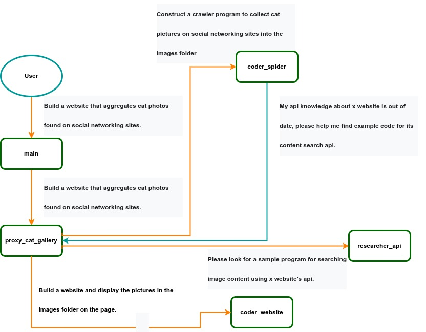

<div align= "center">
    
    <h1>AIlice</h1>
</div>

<p align="center">
  <a href="#quick-start">Quick Start</a> •
  <a href="https://www.youtube.com/@stevenlu-zh6ds">Demo</a> •
  <a href="#development">Development</a> •
  <a href="https://twitter.com/stevenlu1729">Twitter</a> •
  <a href="https://www.reddit.com/r/AIlice/">Reddit</a>
</p>

## Introduction
AIlice is a fully **autonomous, general-purpose AI agent**. This project aims to create a standalone artificial intelligence assistant, similar to JARVIS, based on the open-source LLM. AIlice achieves this goal by building a "text computer" that uses a Large Language Model (LLM) as its core processor. Currently, AIlice demonstrates proficiency in a range of tasks, including **thematic research, coding, system management, literature reviews, and complex hybrid tasks** that go beyond these basic capabilities.

AIlice has reached near-perfect performance in everyday tasks using GPT-4 and is making strides towards practical application with the latest open-source models.

We will ultimately achieve **self-evolution of AI agents**. That is, AI agents will autonomously build their own feature expansions and new types of agents, unleashing LLM's knowledge and reasoning capabilities into the real world seamlessly.

To understand AIlice's present abilities, watch the following videos:

[](https://www.youtube.com/watch?v=4yLO_AnaNmw)

Key technical features of AIlice include:

- **In-depth research capabilities on specialized subjects.**
- **The ability to read and analyze articles and scholarly works.**
- **Advanced automation in programming and script execution, functioning as a comprehensive coder and an efficient system management tool, similar to an AI-powered operating system.**
- **Voice interaction support.**
- **Compatibility with open-source models and seamless integration with commercial models like GPT-4.**
- **A more intuitive and flexible approach to user interaction, allowing for seamless conversation participation as an agent or the ability to intervene during task execution.**
- **Support for multi-modal models.**
- **A natural and highly fault-tolerant Interactive Agents Calling Tree architecture.**
- **Flexible parsing of LLM outputs, enabling a broader range of function call mechanisms.**
- **The capability to self-construct and dynamically load modules for interacting with the environment, providing endless possibilities for expanding features.**

<a name="quick-start"></a>
## Quick Start

Install and run AIlice with the following commands. Once AIlice is launched, use a browser to open the web page it provides, a dialogue interface will appear. Issue commands to AIlice through the conversation to accomplish various tasks. For your first use, you can try the commands provided in the [COOL things we can do](#cool-things-we-can-do) section to quickly get familiarized.

```bash
git clone https://github.com/myshell-ai/AIlice.git
cd AIlice
pip install -e .
ailice_web --modelID=oai:gpt-4-1106-preview --prompt="main"
```

- For a more detailed understanding of the installation and configuration methods, please visit the [Environment Configuration and Running](#environment-configuration-and-running) section and the [Choice of LLM](#choice-of-llm) section.
- To grasp the basic design principles of AIlice, navigate to the [Design](#design) section.


<a name="cool-things-we-can-do"></a>
### COOL things we can do
Let's list some typical use cases. I frequently employ these examples to test AIlice during development, ensuring stable performance. However, even with these tests, the execution results are influenced by the chosen model, code version, and even the testing time. (GPT-4 may experience a decrease in performance under high loads, while open-source models, of course, don't have this issue; they don't have much room for degradation) Additionally, AIlice is an agent based on multi-agent cooperation, and as a user, you are also one of the "agents". Hence, when AIlice requires additional information, it will seek input from you, and the thoroughness of your details is crucial for her success. Furthermore, if the task execution falls short, you can guide her in the right direction, and she will rectify her approach.

The last point to note is that AIlice currently lacks a run time control mechanism, so she might get stuck in a loop or run for an extended period. When using a commercial LLM, you need to monitor her operation closely.

- **"Please list the contents of the current directory."**

- **"Find David Tong's QFT lecture notes and download them to the "physics" folder in the current directory. You may need to create the folder first."**

- **"Deploy a straightforward website on this machine using the Flask framework. Ensure accessibility at 0.0.0.0:59001. The website should have a single page capable of displaying all images located in the 'images' directory."**
This one is particularly interesting. We know that drawing cannot be done in the docker environment, and all the file output we generate needs to be copied using the "docker
cp" command to see it. But you can let AIlice solve this problem by itself: deploy a website in the container according to the above prompt(It is recommended to use ports between 59001 and 59200 that has been port mapped), the images in the directory will be automatically displayed on the web page. In this way, you can dynamically see the generated image content on the host. You can also try to let her iterate to produce more complex functions. If you don't see any images on the page, please check whether the "images" folder of the website is different from the "images" folder here (for example, it might be under "static/images").

- **"Please use python programming to solve the following tasks: obtain the price data of BTC-USDT for six months and draw it into a graph, and save it in the 'images' directory."**
If you successfully deployed the above website, you can now see the BTC price curve directly on the page.


- **"Find the process on port 59001 and terminate it."**
This will terminate the website service program that was just established.

- **"Please use cadquery to implement a cup."**
This is also a very interesting attempt. Cadquery is a python package that uses python programming for cad modeling. We try to use AIlice to automatically build 3D models! This
can give us a glimpse of how mature geometric intuition can be in LLM's world view. Of course, after implementing multimodal support, we can enable AIlice to see the models she creates, allowing for further adjustments and establishing a highly effective feedback loop. This way, it might be possible to achieve truly usable language-controlled 3D modeling.

- **"Please search the internet for 100 tutorials in various branches of physics and download the PDF files you find to a folder named 'physics'. There is no need to verify the content of pdfs, we only need a rough collection for now."** Utilizing AIlice to achieve automatic data set collection and construction is one of our ongoing objectives. Currently, the researcher employed for this functionality still has some deficiencies, but it is already capable of providing some intriguing results.

- **"Please conduct an investigation on open-source PDF OCR tools, with a focus on those capable of recognizing mathematical formulas and converting them into LaTeX code. Consolidate the findings into a report."**

- **"Please write an ext-module. The function of the module is to obtain the content of related pages on the wiki through keywords."** AIlice can construct external interaction modules (we call it ext-modules) on her own, thereby endowing her with unlimited extensibility. All it takes is a few prompts from you. Once the module is constructed, you can instruct AIlice by saying, "Please load the newly implemented wiki module and utilize it to query the entry on relativity."


<a name="environment-configuration-and-running"></a>
## Environment Configuration and Running
Agents need to interact with various aspects of the surrounding environment, their operating environment is often more complex than typical software. It may take us a long time to install the dependencies, but fortunately, this is basically done automatically.

To run AIlice, you need to ensure that **Chrome** are correctly installed. If you need to execute code in a secure virtual environment, you also need to install **Docker**.

You can use the following command to install AIlice (It is strongly recommended to use tools such as conda to create a new virtual environment to install AIlice, so as to avoid dependency conflicts):

```bash
git clone https://github.com/myshell-ai/AIlice.git
cd AIlice
pip install -e .
```

For users who need to use the voice dialogue or model fine-tuning or pdf reading functions, you can use one of the following command(Installing too many features increases the likelihood of dependency conflicts, so it is recommended to install only the necessary parts):

```bash
pip install -e .[speech]
pip install -e .[finetuning]
pip install -e .[pdf-reading]
```

Sometimes the above installation steps cannot be completed successfully because some dependencies are conflicting. You can consider installing all the dependencies of requirements.txt in a new virtual environment to solve this problem:

```bash
pip install -r requirements.txt
pip install -e .
```

AIlice installed in this way also has voice conversation and fine-tuning functions.

You can run AIlice now! Use the commands in [Some Typical Use Cases for Launching AIlice](#some-typical-use-cases-for-launching-ailice).


### Virtual Environment Settings for Code Execution
By default, code execution utilizes the local environment. To prevent potential AI errors leading to irreversible losses, it is recommended to install Docker, build a container, and modify AIlice's configuration file (AIlice will provide the configuration file location upon startup). Configure its code execution module (AScripter) to operate within a virtual environment.

```bash
docker build -t env4scripter .
docker run -d -p 127.0.0.1:59000-59200:59000-59200 --name scripter env4scripter
```

In my case, when AIlice starts, it informs me that the configuration file is located at ~/.config/ailice/config.json, so I modify it in the following way

```bash
nano ~/.config/ailice/config.json
```

Modify "scripter" under "services":

```
{
    ...
    "services": {
        ...
        "scripter": {"cmd": "docker start scripter",
                     "addr": "tcp://127.0.0.1:59000"},
    }
}
```

Now that the environment configuration has been done.

<a name="some-typical-use-cases-for-launching-ailice"></a>
### Some Typical Use Cases for Launching AIlice

You can directly copy a command from the typical use cases below to run AIlice.

```bash
ailice_main --modelID=oai:gpt-4-1106-preview --prompt="main"
ailice_main --modelID=oai:gpt-4-1106-preview --prompt="researcher" --trace=./trace
ailice_main --modelID=oai:gpt-4-turbo-preview --prompt="main"
ailice_main --modelID=hf:Open-Orca/Mistral-7B-OpenOrca --prompt="main" --quantization=8bit --contextWindowRatio=0.6
ailice_web --modelID=hf:openchat/openchat_3.5 --prompt="main" --quantization=8bit --contextWindowRatio=0.6
ailice_web --modelID=hf:NousResearch/Nous-Hermes-2-Mixtral-8x7B-DPO --prompt="main" --quantization=4bit --contextWindowRatio=0.3
ailice_web --modelID=hf:Phind/Phind-CodeLlama-34B-v2 --prompt="coder-proxy" --quantization=4bit --contextWindowRatio=0.6
ailice_web --modelID=lm-studio:Nexesenex/MIstral-QUantized-70b_Miqu-1-70b-iMat.GGUF --prompt="main" --contextWindowRatio=0.4 --speechOn --ttsDevice=cuda --sttDevice=cuda
```

It should be noted that the last use case requires you to configure the LLM inference service first, please refer to [How to Add LLM Support](#how-to-add-llm-support). Using inference frameworks such as LM Studio can use limited hardware resources to support larger models, provide faster inference speed and faster AIlice startup speed, making it more suitable for ordinary users.

When you run it for the first time, you will be asked to enter the api-key of openai. If you only want to use open source LLM, you do not need to enter it. You can also modify the api-key by editing the config.json file. Please note that the first time When using an open source LLM, it will take a long time to download the model weights, please make sure you have enough time and disk space.

When you turn on the speechOn switch for the first time, you may need to wait for a long time at startup. This is because the weights of the speech recognition and TTS models are being downloaded in the background.

As shown in the examples, you can use the Agent through AIliceMain.py or AIliceWeb.py. The former is a command line program, and the latter provides a web dialogue interface based on gradio. Both are used in the same way.

- --**modelID** specifies the model. The currently supported models can be seen in config.json. We will implement a simpler model specification method
in the future.
- --**quantization** is the quantization option, you can choose 4bit or 8bit. The default is not quantized.
- --**maxMemory** is the memory video memory capacity constraint, the default is not set, the format when set is like "{0:"23GiB", 1:"24GiB", "cpu": "64GiB"}".
- --**prompt** specifies the prompt to be executed, which is the type of agent. The default is 'main', this agent will decide to call the appropriate agent type according to your
needs. You can also specify a special type of agent and interact with it directly.
- --**temperature** sets the temperature parameter of LLM reasoning, the default is zero.
- --**flashAttention2** is the switch to enable flash attention 2 to speed up inference. It may have a certain impact on output quality.
- --**contextWindowRatio** is a user-specified proportion coefficient, which determines the proportion of the upper limit of the prompt length constructed during inference to the LLM context window in some cases. The default value is 0.6.
- --**speechOn** is the switch to enable voice conversation.
- --**ttsDevice** specifies the computing device used by the text-to-speech model. The default is "cpu", you can set it to "cuda" if there is enough video memory.
- --**sttDevice** specifies the computing device used by the speech-to-text model. The default is "cpu", you can set it to "cuda" if there is enough video memory.
- --**trace** is used to specify the output directory for the execution history data. This option is empty by default, indicating that the execution history recording feature is not enabled.


### Code Update

Due to the ongoing development status of AIlice, updating the code may result in incompatibility issues between existing configuration file and Docker container with the new code. The most thorough solution for this scenario is to delete the configuration file (making sure to save any API keys beforehand) and the container, and then perform a complete reinstall. However, for most situations, you can address the issue by simply **deleting the configuration file** and **updating the AIlice module within the container**.

```bash
rm ~/.config/ailice/config.json
cd AIlice
docker cp ailice/__init__.py scripter:scripter/ailice/__init__.py
docker cp ailice/common/__init__.py scripter:scripter/ailice/common/__init__.py
docker cp ailice/common/lightRPC.py scripter:scripter/ailice/common/lightRPC.py
docker cp ailice/modules/__init__.py scripter:scripter/ailice/modules/__init__.py
docker cp ailice/modules/AScripter.py scripter:scripter/ailice/modules/AScripter.py
docker cp ailice/modules/AScrollablePage.py scripter:scripter/ailice/modules/AScrollablePage.py
docker restart scripter
```

<a name="choice-of-llm"></a>
## Choice of LLM
AIlice is not yet fully developed, and prompts have not been optimized for each model. Currently, gpt-4 (include gpt-4-1106-preview, which is gpt-4 Turbo) can provide the best results, but due to the long running time of the Agent and the great consumption of tokens, please use gpt-4 with caution.

gpt-3.5-turbo still has problems. It has relatively high requirements for prompts, and we have never been able to find a stable prompt expression.

The original intention of this project is to build agents based on open source LLM. Closed source models are not within the focus of support (so we bypass openai's function
calling mechanism). It can be expected soon in the future, more powerful open source models suitable for agent applications will emerge to make up for this, so we will no
longer spend effort on gpt-3.5-turbo compatibility.

Among the open-source models, the ones that usually perform well include:

- hf:Open-Orca/Mistral-7B-OpenOrca
- hf:openchat/openchat_3.5
- hf:NousResearch/Nous-Hermes-2-Mixtral-8x7B-DPO
- hf:Phind/Phind-CodeLlama-34B-v2
- Nexesenex/MIstral-QUantized-70b_Miqu-1-70b-iMat.GGUF

### The Most Outstanding Open-source Model

We will select the currently best-performing open-source model to provide a reference for users of open-source models. 

- The best among all models: **Nexesenex/MIstral-QUantized-70b_Miqu-1-70b-iMat.GGUF**. This is a model with capabilities close to GPT-4! It is also a model with stable practical value, a very exciting advancement!

- The second-best performing model: **NousResearch/Nous-Hermes-2-Mixtral-8x7B-DPO**

- The best among 7B models: **Open-Orca/Mistral-7B-OpenOrca**

If you find a better model, please let me know.

<a name="how-to-add-llm-support"></a>
### How to Add LLM Support
For advanced players, it is inevitable to try more models. Fortunately, this is not difficult to achieve. 

#### Models(or Services) compatible with OpenAI Interface

For openai models, you don't need to do anything. Just use the modelID consisting of the official model name appended to the "oai:" prefix.

You can use any third-party inference server compatible with the OpenAI API to replace the built-in LLM inference functionality in AIlice. 
Just use the same configuration format as the openai models and modify the baseURL, apikey, contextWindow and other parameters.

For inference servers that do not support the OpenAI API, you can try using litellm to convert them into an OpenAI-compatible API. 

It's important to note that due to the presence of many SYSTEM messages in AIlice's conversation records, which is not a common use case for LLM, the level of support for this depends on the specific implementation of these inference servers. In this case,  you can set the systemAsUser parameter to true to circumvent the issue. Although this might prevent the model from running AIlice at its optimal performance, it also allows us to be compatible with various efficient inference servers. For the average user, the benefits outweigh the drawbacks.

##### Example 1: ollama + litellm
We use Ollama as an example to explain how to add support for such services.
First, we need to use Litellm to convert Ollama's interface into a format compatible with OpenAI.

```bash
pip install litellm
ollama pull mistral-openorca
litellm --model ollama/mistral-openorca --api_base http://localhost:11434 --temperature 0.0 --max_tokens 8192
```

Then, add support for this service in the config.json file (the location of this file will be prompted when AIlice is launched).

```json
{
  "maxMemory": {},
  "quantization": null,
  "models": {
    "oai": {
      ...
    },
    "ollama": {
      "modelWrapper": "AModelChatGPT",
      "apikey": "fake-key",
      "baseURL": "http://localhost:8000",
      "modelList": {
        "mistral-openorca": {
          "contextWindow": 8192,
          "systemAsUser": false
        }
      }
    },
    ...
  },
  ...
}
```

Now we can run AIlice:

```bash
ailice_main --modelID=ollama:mistral-openorca --prompt="main"
```

##### Example 2: LM Studio

In this example, we will use LM Studio to run the currently most powerful open-source model **Nexesenex/MIstral-QUantized-70b_Miqu-1-70b-iMat.GGUF**, powering AIlice to run on a local machine.

Download model weights of **Nexesenex/MIstral-QUantized-70b_Miqu-1-70b-iMat.GGUF** using LM Studio.

In the LM Studio's "LocalServer" window, set n_gpu_layers to -1 if you want to use GPU only. Adjust the 'Context Length' parameter on the left to 16384(or a smaller value based on your available memory), and change the 'Context Overflow Policy' to 'Stop at limit.' We will allow AIlice to manage the context on its own.

Run the service. We assume the address of the service is "http://localhost:1234/v1/".

Then, we open config.json and make the following modifications:

```json
{
  "maxMemory": {},
  "quantization": null,
  "models": {
    "oai": {
      ...
    },
    "lm-studio": {
      "modelWrapper": "AModelChatGPT",
      "apikey": "fakekey",
      "baseURL": "http://localhost:1234/v1/",
      "modelList": {
        "Nexesenex/MIstral-QUantized-70b_Miqu-1-70b-iMat.GGUF": {
          "formatter": "AFormatterGPT",
          "contextWindow": 32764,
          "systemAsUser": true
        }
      }
    },
    ...
  },
  ...
}
```

Finally, run AIlice. You can adjust the 'contextWindowRatio' parameter based on your available VRAM or memory space. The larger the parameter, the more VRAM space is required.

```bash
ailice_main --modelID=lm-studio:Nexesenex/MIstral-QUantized-70b_Miqu-1-70b-iMat.GGUF --prompt="main" --contextWindowRatio=0.5
```

##### Example 3: Add open source multimodal model support

Similar to what we did in the previous section, after we use LM Studio to download and run LLAVA, we modify the configuration file as follows:

```json
{
  "maxMemory": {},
  "quantization": null,
  "models": {
    "oai": {
      ...
    },
    "lm-studio": {
      "modelWrapper": "AModelChatGPT",
      "apikey": "fakekey",
      "baseURL": "http://localhost:1234/v1/",
      "modelList": {
        "llava-1.6-34b": {
          "formatter": "AFormatterGPTVision",
          "contextWindow": 4096,
          "systemAsUser": true
        }
      },
    },
    ...
  },
  ...
}
```

However, it should be noted that the current open source multi-modal model is far from sufficient to perform agent tasks, so this example is for developers rather than users.


#### Open Source Models on Huggingface

For open source models on Huggingface, you only need to know the following information to add support for new models: The huggingface address of the model, the prompt format of the model, and the context window length.
Usually one line of code is enough to add a new model, but occasionally you are unlucky and you need about a dozen lines of code.

Here is the complete method of adding new LLM support:

Open config.json, you should add the config of new LLM into models.hf.modelList, which looks like the following:

```json
{
  "maxMemory": {},
  "quantization": null,
  "models": {
    "hf": {
      "modelWrapper": "AModelLLAMA",
      "modelList": {
        "meta-llama/Llama-2-13b-chat-hf": {
          "formatter": "AFormatterLLAMA2",
          "contextWindow": 4096,
          "systemAsUser": false
        },
        "meta-llama/Llama-2-70b-chat-hf": {
          "formatter": "AFormatterLLAMA2",
          "contextWindow": 4096,
          "systemAsUser": false
        },
        ...
      }
    },
  ...
  }
...
}
```

- "formatter" is a class that defines LLM's prompt format. You can find their definitions in core/llm/AFormatter. You can read these codes to determine which format is required for the model you want to add. In case you don't find it, You need to write one yourself. Fortunately, Formatter is a very simple thing and can be completed in more than a dozen lines of code. I believe you will understand how to do it after reading a few Formatter source codes.

- The context window is a property that the LLM of the Transformer architecture usually has. It determines the length of text that the model can process at one time. You need to set the context window of the new model to the "contextWindow" key.

- "systemAsUser": We use the "system" role as the sender of the message returned by the function calls. However, not all LLMs have a clear definition of system role, and there is no guarantee that the LLM can adapt to this approach. So we need to use systemAsUser to set whether to put the text returned by the function calls in user messages. Try to set it to False first.

Everything is done! Use "hf:" as a prefix to the model name to form a modelID, and use the modelID of the new model as the command parameter to start AIlice!


<a name="development"></a>
## Development

<a name="design"></a>
### Design
The basic principles when designing AIlice are:

- **Enriching the behavior of LLM with highly dynamic prompt construction mechanisms;**
- **Separating different computational tasks as much as possible, using recursion and divide-and-conquer from traditional computing to solve complex problems.**
- **Agents should be able to interact in both directions.**

Let's briefly explain these fundamental principles.

Starting from the most obvious level, a highly dynamic prompt construction makes it less likely for an agent to fall into a loop. The influx of new variables from the external environment continuously impacts the LLM, helping it to avoid that pitfall. Furthermore, feeding the LLM with all the currently available information can greatly improve its output. For example, in automated programming, error messages from interpreters or command lines assist the LLM in continuously modifying the code until the correct result is achieved. Lastly, in dynamic prompt construction, new information in the prompts may also come from other agents, which acts as a form of linked inference computation, making the system's computational mechanisms more complex, varied, and capable of producing richer behaviors.

Separating computational tasks is, from a practical standpoint, due to our limited context window. We cannot expect to complete a complex task within a window of a few thousand tokens. If we can decompose a complex task so that each subtask is solved within limited resources, that would be an ideal outcome. In traditional computing models, we have always taken advantage of this, but in new computing centered around LLMs, this is not easy to achieve. The issue is that if one subtask fails, the entire task is at risk of failure. Recursion is even more challenging: how do you ensure that with each call, the LLM solves a part of the subproblem rather than passing the entire burden to the next level of the call? We have solved the first problem with the IACT architecture in AIlice, and the second problem is theoretically not difficult to solve, but it likely requires a smarter LLM.

The third principle is what everyone is currently working on: having multiple intelligent agents interact and cooperate to complete more complex tasks. The implementation of this principle actually addresses the aforementioned issue of subtask failure. Multi-agent collaboration is crucial for the fault tolerance of agents in operation. In fact, this may be one of the biggest differences between the new computational paradigm and traditional computing: traditional computing is precise and error-free, assigning subtasks only through unidirectional communication (function calls), whereas the new computational paradigm is error-prone and requires bidirectional communication between computing units to correct errors. This will be explained in detail in the following section on the IACT framework.


#### Computational Model: Interactive Agents Calling Tree

*IACT Architecture Diagram. A user requirement to build a page for image collection and display is dynamically decomposed into two tasks: coder_spider and coder_website. When coder_spider encounters difficulties, it proactively seeks assistance from its caller, proxy_cat_gallery. Proxy_cat_gallery then creates another agent, researcher_api, and employs it to address the issue.*

AIlice can be regarded as **a computer powered by a LLM**, and its features include:

- Representing input, output, programs, and data in text form.

- Using LLM as the processor.

- Breaking down computational tasks through successive calls to basic computing units (analogous to functions in traditional computing), which are essentially various functional agents.

Therefore, **user-input text commands are executed as a kind of program, decomposed into various "subprograms", and addressed by different agents**, forming the fundamental architecture of AIlice. In the following, we will provide a detailed explanation of the nature of these basic computing units.

A natural idea is to let LLM solve certain problems (such as information retrieval, document understanding, etc.) through multi-round dialogues with external callers and
peripheral modules in the simplest computational unit. We temporarily call this computational unit a "function". Then, by analogy with traditional computing, we allow 
functions to call each other, and finally add the concept of threads to implement multi-agent interaction. However, we can have a **much simpler and more elegant computational
model** than this.

The key here is that the "function" that wraps LLM reasoning can actually be called and returned multiple times. A "function" with coder functionality can pause work and
return a query statement to its caller when it encounters unclear requirements during coding. If the caller is still unclear about the answer, it continues to ask the next
higher level caller. This process can even go all the way to the final user's chat window. When new information is added, the caller will reactivate the coder's execution
process by passing in the supplementary information. It can be seen that this "function" is not a traditional function, but an object that can be called multiple times. 
The high intelligence of LLM makes this interesting property possible. You can also see it as **agents strung together by calling relationships, where each agent can create and call more sub-agents, and can also dialogue with its caller to obtain supplementary information or report its progress**. In AIlice, we call this computational unit
**"AProcessor"**(essentially what we referred to as an agent). Its code is located in core/AProcessor.py.

#### Basic Computing Unit: Tai Chi Diagram of LLM and Interpreter
Next, we will elaborate on the structure inside AProcessor. The interior of AProcessor is a multi-round dialogue. The "program" that defines the function of AProcessor
is a prompt generation mechanism, which generates the prompt for each round of dialogue from the dialogue history. The dialogue is one-to-many. After the external caller
inputs the request, LLM will have multiple rounds of dialogue with the peripheral modules (we call them SYSTEM), LLM outputs function calls in various grammatical forms,
and the system calls the peripheral modules to generate results and puts the results in the reply message. LLM finally gets the answer and responds to the external caller,
ending this call. But because the dialogue history is still preserved, the caller can call in again to continue executing more tasks. 

The last part we want to introduce
is the parsing module for LLM output. In fact, **we regard the output text of LLM as a "script" of semi-natural language and semi-formal language, and use a simple interpreter to execute it**. We can use regular expressions to express a carefully designed grammatical structure, parse it into a function call and execute it. Under this design, we
can design more flexible function call grammar forms, such as a section with a certain fixed title (such as "UPDATE MEMORY"), which can also be directly parsed out and
trigger the execution of an action. This implicit function call does not need to make LLM aware of its existence, but only needs to make it strictly follow a certain format
convention. For the most hardcore possibility, we have left room. The interpreter here can not only use regular expressions for pattern matching, its Eval function is
recursive. We don't know what this will be used for, but it seems not bad to leave a cool possibility, right? Therefore, inside AProcessor, the calculation is alternately
completed by LLM and the interpreter, their outputs are each other's inputs, forming a cycle.

#### Agent Design: Implementing the Interpreter Framework
In AIlice, the interpreter is one of the most crucial components within an agent. We use the interpreter to map texts from the LLM output that match specific patterns to actions, including function calls, variable definitions and references, and any user-defined actions. Sometimes these actions directly interact with peripheral modules, affecting the external world; other times, they are used to modify the agent's internal state, thereby influencing its future prompts.

The basic structure of the interpreter is straightforward: a list of pattern-action pairs. Patterns are defined by regular expressions, and actions are specified by a Python function with type annotations. Given that syntactic structures can be nested, we refer to the overarching structure as the entry pattern. During runtime, the interpreter actively detects these entry patterns in the LLM output text. Upon detecting an entry pattern (and if the corresponding action returns data), it immediately terminates the LLM generation to execute the relevant action.

The design of agents in AIlice encompasses two fundamental aspects: the logic for generating prompts based on dialogue history and the agent's internal state, and a set of pattern-action pairs. Essentially, the agent implements the interpreter framework with a set of pattern-action pairs; it becomes an integral part of the interpreter. The agent's internal state is one of the targets for the interpreter's actions, with changes to the agent's internal state influencing the direction of future prompts.

Generating prompts from dialogue history and the internal state is nearly a standardized process, although developers still have the freedom to choose entirely different generation logic. The primary challenge for developers is to create a system prompt template, which is pivotal for the agent and often demands the most effort to perfect. However, this task revolves entirely around crafting natural language prompts.

#### Scripting Language: From Text to Reality
AIlice utilizes a simple scripting language embedded within text to map the text-based capabilities of LLMs to the real world. This straightforward scripting language includes non-nested function calls and mechanisms for creating and referencing variables, as well as operations for concatenating text content. Its purpose is to enable LLMs to exert influence on the world more naturally: from smoother text manipulation abilities to simple function invocation mechanisms, and multimodal variable operation capabilities.

The basic syntax is as follows:

Variable Definition:
VAR_NAME := <!|"SOME_CONTENT"|!>

Function Calls/Variable References/Text Concatenation:
!FUNC_NAME<!|"...", '...', VAR_NAME1, "Execute the following code: \n" + VAR_NAME2, ...|!>

The basic variable types are str/AImage/various multimodal types. The str type is consistent with Python's string syntax, supporting triple quotes and escape characters.

This constitutes the entirety of the embedded scripting language.

The variable definition mechanism introduces a way to extend the context window, allowing LLMs to record important content into variables to prevent forgetting. During system operation, various variables are automatically defined. For example, if a block of code wrapped in triple backticks is detected within a text message, a variable is automatically created to store the code, enabling the LLM to reference the variable to execute the code, thus avoiding the time and token costs associated with copying the code in full. Furthermore, some module functions may return data in multimodal types rather than text. In such cases, the system automatically defines these as variables of the corresponding multimodal type, allowing the LLM to reference them (the LLM might send them to another module for processing).

#### Multimodal: Collaboration of Rich Text and Variable Mechanisms
In the long run, LLMs are bound to evolve into multimodal models capable of seeing and hearing. Therefore, the exchanges between AIlice's agents should be in rich text, not just plain text. While Markdown provides some capability for marking up multimodal content, it is insufficient. Hence, we will need an extended version of Markdown in the future to include various embedded multimodal data such as videos and audio.

Let's take images as an example to illustrate the multimodal mechanism in AIlice. When agents receive text containing Markdown-marked images, the system automatically inputs them into a multimodal model to ensure the model can see these contents. Markdown typically uses paths or URLs for marking, so we have expanded the Markdown syntax to allow the use of variable names to reference multimodal content.

Another minor issue is how different agents with their own internal variable lists exchange multimodal variables. This is simple: the system automatically checks whether a message sent from one agent to another contains internal variable names. If it does, the variable content is passed along to the next agent.

Why do we go to the trouble of implementing an additional multimodal variable mechanism when marking multimodal content with paths and URLs is much more convenient? This is because marking multimodal content based on local file paths is only feasible when AIlice runs entirely in a local environment, which is not the design intent. AIlice is meant to be distributed, with the core and modules potentially running on different computers, and it might even load services running on the internet to provide certain computations. This makes returning complete multimodal data more attractive. Of course, these designs made for the future might be over-engineering, and if so, we will modify them in the future.

#### Self-Expansion: Growing Like a Tree
One of the goals of AIlice is to achieve introspection and self-expansion (which is why our logo features a butterfly with its reflection in the water). This would enable her to understand her own code and build new functionalities, including new external interaction modules (i.e. new functions) and new types of agents (APrompt class). As a result, the knowledge and capabilities of LLMs would be more thoroughly unleashed.

Implementing self-expansion involves two parts. On one hand, new modules and new types of agents (APrompt class) need to be dynamically loaded during runtime and naturally integrated into the computational system to participate in processing, which we refer to as dynamic loading. On the other hand, AIlice needs the ability to construct new modules and agent types.

The dynamic loading mechanism itself is of great significance: it represents a novel software update mechanism. We can allow AIlice to search for its own extension code on the internet, check the code for security, fix bugs and compatibility issues, and ultimately run the extension as part of itself. Therefore, AIlice developers only need to place their contributed code on the internet, without the need to merge into the main codebase or consider any other installation methods. The implementation of the dynamic loading mechanism is continuously improving. Its core lies in the extension packages providing some text describing their functions. During runtime, each agent in AIlice finds suitable functions or agent types to solve sub-problems for itself through semantic matching and other means.

Building new modules is a relatively simple task, as the interface constraints that modules need to meet are very straightforward. We can teach LLMs to construct new modules through an example. The more complex task is the self-construction of new agent types (APrompt class), which requires a good understanding of AIlice's overall architecture. The construction of system prompts is particularly delicate and is a challenging task even for humans. Therefore, we pin our hopes on more powerful LLMs in the future to achieve introspection, allowing AIlice to understand herself by reading her own source code (for something as complex as a program, the best way to introduce it is to present itself), thereby constructing better new agents.


### Comparison

We have designed several dimensions to compare AIlice with mainstream AI agents. These include:

- **Multi-agents**:
Whether problems are addressed through multi-agent dialogues. This can enhance fault tolerance.

- **Dynamic Creation**:
The ability to dynamically create agents during task execution. This helps to break down tasks into subtasks, reducing context consumption within agents.

- **Interactive Calling**:
Whether dynamically created agents can interact with their creators (callers). This improves fault tolerance for subtask failures and allows users to naturally participate as collaborators.

- **Long Term Memory**:
The technical solutions used for long-term memory. Enabling LLM to surpass its context window constraints and accomplish more complex tasks.

- **Function Call Syntax**:
The syntax for function calls. Diverse syntax supports provide LLM with more flexible ways of external interaction.

- **Self-expansion**:
Modules for self-expansion. Allowing the agent to build more functionalities for itself, avoiding the manual development of numerous external interaction modules.

- **Multimodal**:
Support for multimodal models. The support for multimodal models will enable the agent to have a broader range of applications.

- **Code Size**:
The number of lines of code. A smaller codebase enables developers to better understand its internal logic and exert stronger control over the code. Ultimately, simple code implementation makes self-reflection and self-expansion for the agent simpler.

Please note that this is an ongoing research, and the data in the table may be inaccurate due to oversights in my investigation or rapid progress in these projects. If any errors are identified, please point them out.

|  | Multi-agents | Dynamic Creation | Interactive Calling | Long Term Memory | Function Call Syntax | Self-expansion | Multimodal | Code Size |
|:------:|:------:|:------:|:------:|:------:|:------:|:------:|:------:|:------:|
| AutoGen | Y | Y | N | RAG and more | JSON | N | Y | 35419 |
| AIlice | Y | Y | Y | RAG and more, in dev | Arbitrary | Y | Y | 3375 |

The number of lines of code is calculated in the latest code base via the "git ls-files "*.py" | xargs wc -l" command.


### How Developers Should Get Started

- For developing Agents, the main loop of AIlice is located in the AIliceMain.py or AIliceWeb.py files. To further understand the construction of an agent, you need to read the code in the "prompts" folder, by reading these code you can understand how an agent's prompts are dynamically constructed.

- For developers who want to understand the internal operation logic of AIlice, please read core/AProcessor.py and core/Interpreter.py. These two files contain approximately three
hundred lines of code in total, but they contain the basic framework of AIlice.

### Project Development Standards and Constraints

- In this project, **achieving the desired functionality of the AI Agent is the primary goal. The secondary goal is code clarity and simplicity**. The implementation of the AI Agent is still an exploratory topic, so we aim to **minimize rigid components in the software (such as architecture/interfaces imposing constraints on future development) and provide maximum flexibility for the application layer (e.g., prompt classes)**. Abstraction, deduplication, and decoupling are not immediate priorities.

- When implementing a feature, **always choose the best method rather than the most obvious one**. The metric for "best" often includes traits such as trivializing the problem from a higher perspective, maintaining code clarity and simplicity, and ensuring that changes do not significantly increase overall complexity or limit the software's future possibilities.

- Adding comments is not mandatory unless absolutely necessary; **strive to make the code clear enough to be self-explanatory**. While this may not be an issue for developers who appreciate comments, in the AI era, we can generate detailed code explanations at any time, eliminating the need for unstructured, hard-to-maintain comments.

- Follow the principle of Occam's razor when adding code; **never add unnecessary lines**.

- **Functions or methods in the core should not exceed 60 lines**.

- While there are no explicit coding style constraints, maintain consistency or similarity with the original code in terms of naming and case usage to avoid readability burdens. 

AIlice aims to achieve multimodal and self-expanding features within a scale of less than 5000 lines, reaching its final form at the current stage. The pursuit of concise code is not only because succinct code often represents a better implementation, but also because it enables AI to develop introspective capabilities early on and facilitates better self-expansion. Please adhere to the above rules and approach each line of code with diligence.

### Future Development Roadmap

AIlice's fundamental tasks are twofold: **one is to fully unleash the capabilities of LLM based on text into the real world; the other is to explore better mechanisms for long-term memory and forming a coherent understanding of vast amounts of text**. Our development efforts revolve around these two focal points.

If you are interested in the development of AIlice itself, you may consider the following directions:

- Explore improved **long-term memory mechanisms** to enhance the capabilities of each Agent.

- **Multimodal** support. The support for the multimodal model has been completed, and the current development focus is shifting towards the multimodal support of peripheral modules. In particular, we need a browser specially designed for AI agents. It should be able to retrieve webpage text and multimodal content, while also supporting the manipulation of web pages through function calls, such as user login.

- **Self-expanding** support. Our goal is to enable language models to **autonomously code and implement new peripheral modules and dynamically load them for immediate use**. This capability will enable self-expansion, empowering the system to seamlessly integrate new functionalities. It has been implemented, but it still needs to be improved so that various agents can easily use dynamically loaded modules.

- **Richer UI interface**. Currently, we only have a rudimentary conversational web page. We need a more comprehensive and multimodal interface.

- **Develop Agents** with various functionalities based on the current framework.

- **Explore the application of IACT architecture on complex tasks.** By utilizing an interactive agents calling tree, we can break down large documents for improved reading comprehension, as well as decompose complex software engineering tasks into smaller modules, completing the entire project build and testing through iterations. This requires a series of intricate prompt designs and testing efforts, but it holds an exciting promise for the future. The IACT architecture significantly alleviates the resource constraints imposed by the context window, allowing us to dynamically adapt to more intricate tasks.

- **Automated AI agents evaluation methods.**

In addition to the tasks mentioned above, we should also start actively contemplating the possibility of **creating a smaller LLM that possesses lower knowledge content but higher reasoning abilities**.
